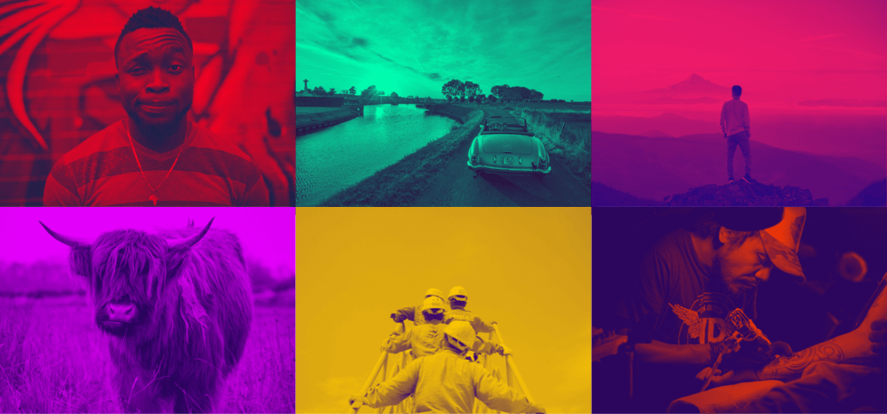

# DUOTONE

Apply [duotone](https://en.wikipedia.org/wiki/Duotone) effects to images with Python. Also check out the [GPU acceleratedt Swift version](https://github.com/carloe/duotone-swift).



## Install

### Local
```bash
git clone git@github.com:carloe/duotone.git
cd duotone
pip install -e .
duotone --help
```

### Docker

```bash
git clone git@github.com:carloe/duotone.git
cd duotone
docker build . -t duotone
docker run duotone --help
```

## Usage

### Command Line

```bash
dutone --input input.png --light_color '#FFCB00' --dark_color '#38046C' --out output.png
```

### Library

```python
light_values = ImageColor.getrgb('#FFCB00')
dark_values = ImageColor.getrgb('#38046C')
image = Image.open('some.png')
result = Duotone.process(image, light_values, dark_values, contrast)
result.save('result.png', 'PNG')
```

## License

MIT
